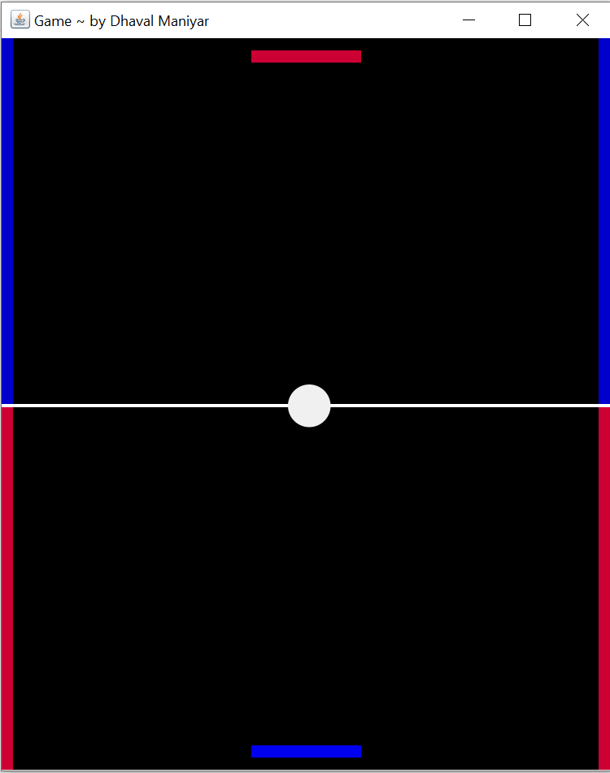
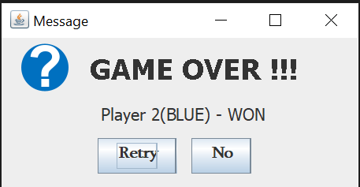

# My-Projects
# MY FIRST PROJECT ON JAVA

This is the Game which is made with the help of Netbeans Swing. This is a two player game. In this game the radius of the ball is decrease as the ball hits the walls on either left or right side.At any time the radius of the ball becomes invisible. If the balls becomes invisible on Player2(RED SLIDER) side then the winner is Player2(BLUE SLIDER) and vice versa. so, the players have to made the ball hits on the walls as many as possile.

As this is the two player game i.e one slider handled by one player and another slider by other player.The Red silder(UPPER SLIDER) is moved by LEFT-RIGHT ARROW KEYS and Blue slider(LOWER SLIDER) is moved by button 'A' and button 'D'. Initially the ball is at middle position so to let the ball move SPACE KEY is pressed.

After the game is over i.e ball becomes invisible or the player not able to hit the ball in opposite direction then a window is poped up 
with the result of the game.

This are some glimpse of the Ping-Pong game:

